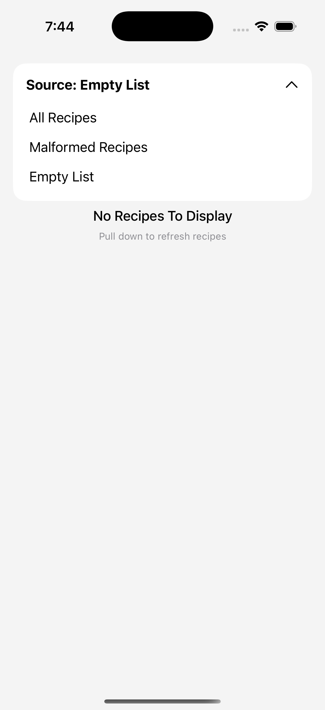
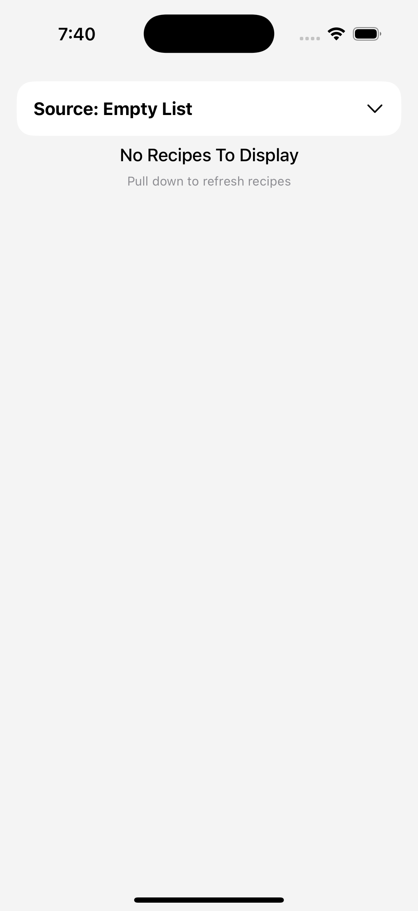
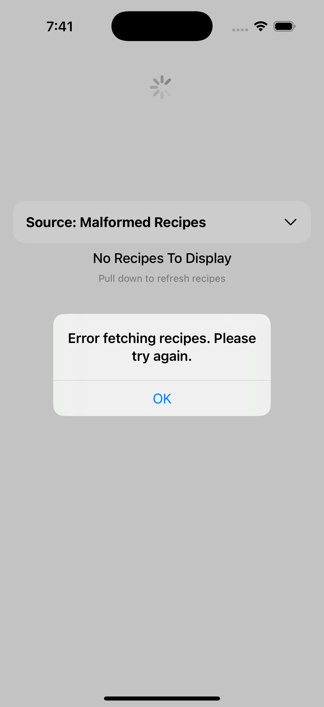
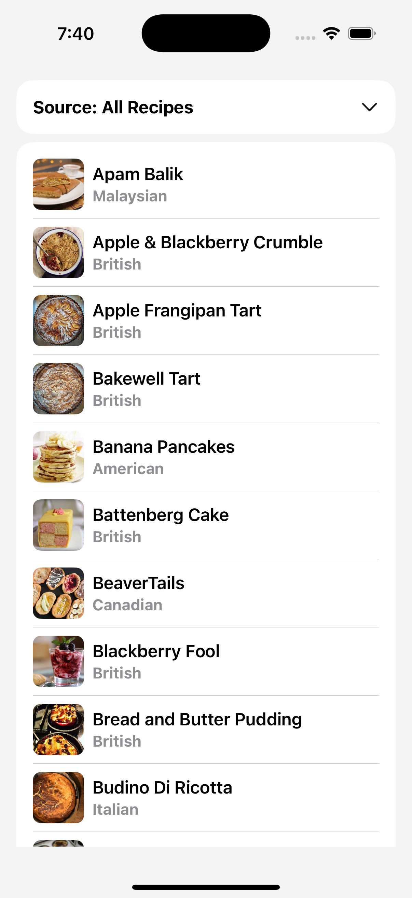
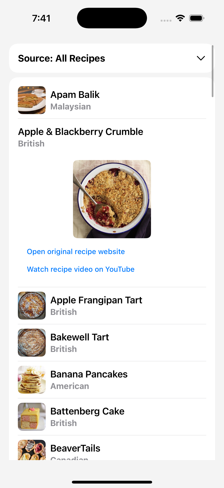

### Summary: 
The core feature of this client is to view a list of recipes from a specified source. 
The user can load the recipes by pulling down to refresh the list with the specified source. From there, the user can view a recipe and navigate to its source or YouTube site respectively.

In the above screenshot the user can tap the source dropdown to choose their preferred source. They can choose between getting all recipes, getting malformed data, or getting nothing.

In the above screenshot, when the source is empty, nothing is displayed except for info text indicating that there are no recipes and that the user can pull to refresh the list.

In the above screenshot, when the user attempts to refresh with the malformed recipes source, an error alert modal displays to the user, indicating that there was an error with obtaining the recipes.

In the above screenshot, when the user attempts to refresh with the all recipes source, the user is able to see a list of recipes, with an image, name, and cuisine of the recipe displayed on the cell header

In the above screenshot, when the user taps a recipe cell, it dynamically expands to reveal a larger image of the cuisine, as well as hyperlink sources for the recipe respectively.

### Focus Areas:
I chose to focus on the UI portion of this project, from desiging and implementing. With regards to the other parts of this project, I belive that there are some standard practices/paradigms when
using async/await and networking, of which I've tried to do my best to follow. I also put a larger focus on the "saving images to disk" portion of this project, since demonstrating the ability 
to cache and store data to prevent making unnecessarily making network requests demonstrates an understanding of preventing wasted resources.  

### Time Spent:
Approx. time: 11-13 hours total over the course of a few days
I began with outlining the requirements of this project and understanding the asks (network requests, caching, etc.). After doing so, I began designing how I wanted this app to look and perform. 
After outlining and designing the core UI and Service classes, I began working on the ImageDownloader class to handle caching images, and then unit tests.

### Trade-offs and Decisions:
For the sake of time, I took a simple, generic approach with handling error messages, with only showing an error modal if there was an error when retrieving the recipe data. I also took a very
simple, but functional, UI approach in providing the required information to the user. With more time, I would have attempted to design a better UI experience for the user without sacrificing
performance concerns. On the note of performance concerns, I also took what I believe to be a conceptually simple, but overly-complicated-when-implementing approach with caching the images.

### Weakest Part of the Project:
The weakest part I believe has to be unit testing. Though I believe I've covered my bounds, I took a very simple approach with unit testing by using dependency injection to mock the different
services, classes, etc., where I only covered core behavior and not much else for edge cases. I also took what I believe to be an over complicated approach with caching the images. Since I 
needed to cache them to the disk, I don't know of any other method besides using FileManager, of which I believe I took a very complicated path of creating the respective directories for each 
image independently.

### Additional Information:
This has been a fun and rewarding project. I currently work on iOS clients that use both UIKit and SwiftUI, but our SwiftUI paradigms are very new, maybe a little over a year old now, so working 
with a strictly SwiftUI app has definitely been a nice learning experience. There were many things I didn't know and questions I asked which resulted in a lot of googling, browsing the famous 
Hacking With Swift site and the infamous StackOverflow, and it was rewarding the whole way through.